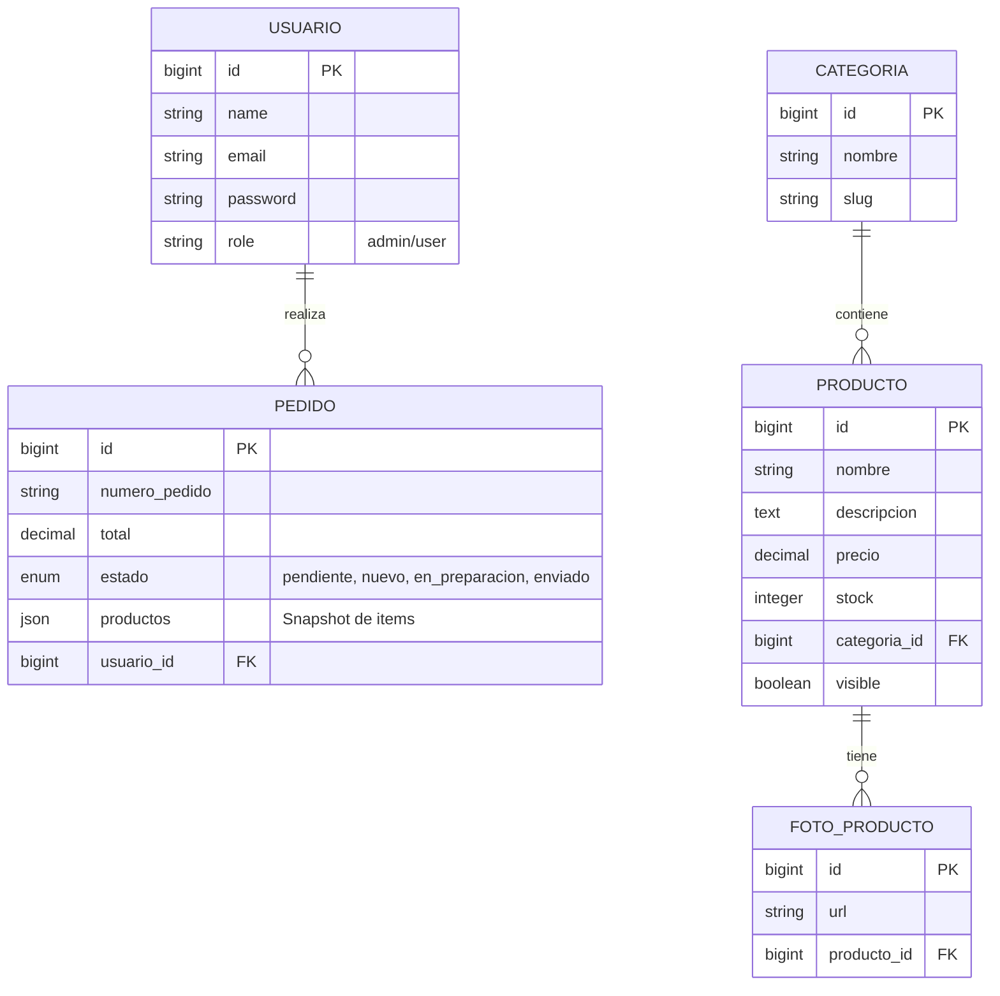
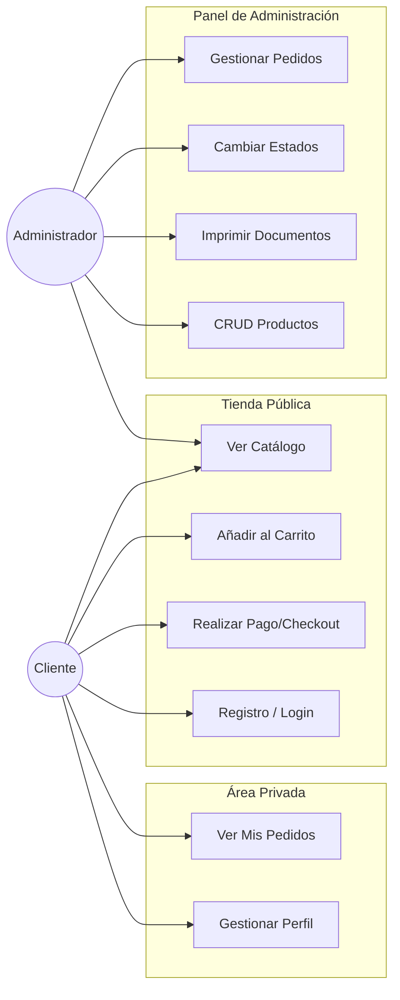

# U-Key - Tienda de Periféricos Gaming

Proyecto de tienda online desarrollada con Laravel para la asignatura de Desarrollo Web. Permite la gestión de catálogo, pedidos y usuarios, con un panel de administración completo.

## 🚀 Tecnologías Utilizadas

- **Backend**: Laravel 12, PHP 8.2
- **Frontend**: Blade, Bootstrap 5, Bootstrap Icons
- **Base de Datos**: MySQL / MariaDB
- **Pagos**: Integración con Stripe (Mock)

## 📋 Funcionalidades

### Cliente
- Navegación por catálogo y categorías (Teclados, Ratones, Accesorios).
- Carrito de compras persistente.
- Proceso de Checkout integrado.
- Registro y Login de usuarios.
- **Área de Cliente**: Historial de pedidos con estados en tiempo real.

### Administrador
- **Dashboard de Pedidos**: Gestión de estados (Pendiente, Preparación, Enviado), filtrado y búsqueda.
- **Gestión de Productos**: CRUD completo con soporte para múltiples imágenes.
- **Documentación**: Generación de Packing List y Etiquetas de Envío.

## 🛠️ Instalación

1.  Clonar el repositorio:
    ```bash
    git clone https://github.com/tu-usuario/u-key.git
    ```
2.  Instalar dependencias de PHP y Node:
    ```bash
    composer install
    npm install
    ```
3.  Configurar entorno:
    ```bash
    cp .env.example .env
    php artisan key:generate
    ```
4.  Configurar base de datos en `.env` y migrar:
    ```bash
    php artisan migrate --seed
    ```
5.  Compilar assets y servir:
    ```bash
    npm run build
    php artisan serve
    ```

---

## 📊 Diseño del Proyecto

### Diagrama Entidad-Relación (ERD)

Estructura lógica de la base de datos. Nota: Los detalles de productos en los pedidos se almacenan como JSON para mantener un historial inmutable del precio/nombre en el momento de la compra.



### Diagrama de Casos de Uso

Interacciones principales de los actores con el sistema.

